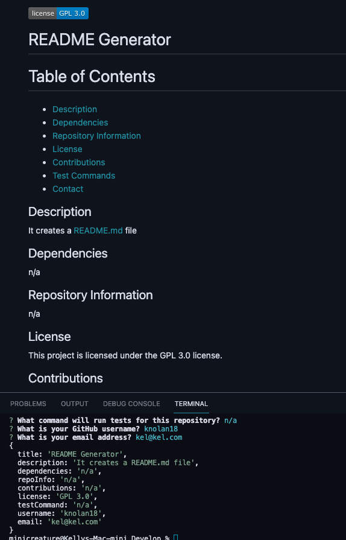

## README Generator

## Description
For this assignment, a README Generator was written to provide a template for a README.md. The README Generator allows the user to efficiently generate a README.md file in their console for their project. The user is prompted to answer a series to questions to create an array of answers that is then used to fill out the README Generator's README template. 

## Completed Assignment

## Link to Deployed Site

## Link to Screencastify Walkthrough Video

https://watch.screencastify.com/v/85OQSzEEKWFAfMOn8NLb
